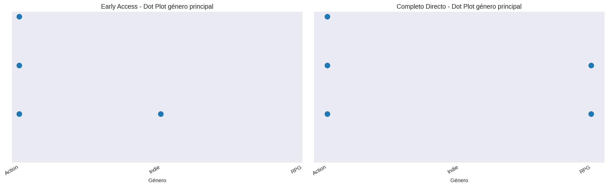

# Género Principal

## Frecuencias

### Juegos en Early Access
| Categoría / Intervalo | fi | hi | Fi | Hi |
|---|---:|---:|---:|---:|
| Action | 3 | 0.75 | 3 | 0.75 |
| Indie | 1 | 0.25 | 4 | 1.0 |
| RPG | 0 | 0.0 | 4 | 1.0 |

**Total de juegos:** 4

### Juegos en Completo Directo
| Categoría / Intervalo | fi | hi | Fi | Hi |
|---|---:|---:|---:|---:|
| Action | 4 | 0.667 | 4 | 0.667 |
| Indie | 0 | 0.0 | 4 | 0.667 |
| RPG | 2 | 0.333 | 6 | 1.0 |

**Total de juegos:** 6

### Visualización

