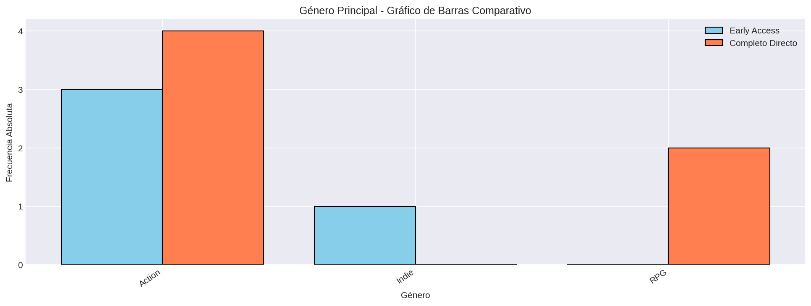

# Género Principal

## Frecuencias

El conjunto actual contiene 44 juegos: 19 en Early Access y 25 en Completo Directo.

### Juegos en Early Access
| Categoría / Intervalo | fi | hi | Fi | Hi |
|---|---:|---:|---:|---:|
| Action | 13 | 0.684 | 13 | 0.684 |
| Adventure | 1 | 0.053 | 14 | 0.737 |
| Casual | 0 | 0.0 | 14 | 0.737 |
| Indie | 3 | 0.158 | 17 | 0.895 |
| RPG | 0 | 0.0 | 17 | 0.895 |
| Racing | 1 | 0.053 | 18 | 0.947 |
| Simulation | 1 | 0.053 | 19 | 1.0 |
| Strategy | 0 | 0.0 | 19 | 1.0 |

**Total de juegos:** 19

### Juegos en Completo Directo
| Categoría / Intervalo | fi | hi | Fi | Hi |
|---|---:|---:|---:|---:|
| Action | 16 | 0.64 | 16 | 0.64 |
| Adventure | 1 | 0.04 | 17 | 0.68 |
| Casual | 1 | 0.04 | 18 | 0.72 |
| Indie | 1 | 0.04 | 19 | 0.76 |
| RPG | 4 | 0.16 | 23 | 0.92 |
| Racing | 1 | 0.04 | 24 | 0.96 |
| Simulation | 0 | 0.0 | 24 | 0.96 |
| Strategy | 1 | 0.04 | 25 | 1.0 |

**Total de juegos:** 25

### Visualización

### Visualización - Dispersograma

