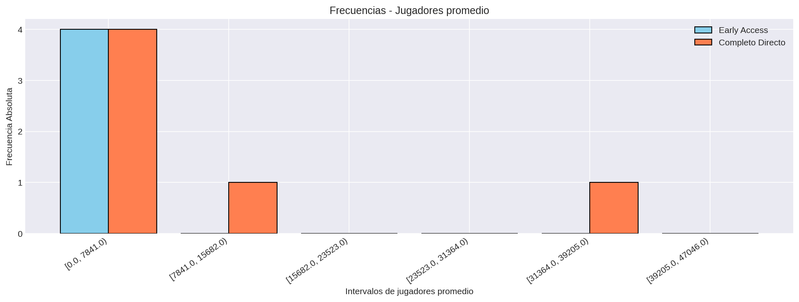

# Jugadores Promedio

## Frecuencias

### Juegos en Early Access
| Categoría / Intervalo | fi | hi | Fi | Hi |
|---|---:|---:|---:|---:|
| [0.0, 7841.0) | 4 | 1.0 | 4 | 1.0 |
| [7841.0, 15682.0) | 0 | 0.0 | 4 | 1.0 |
| [15682.0, 23523.0) | 0 | 0.0 | 4 | 1.0 |
| [23523.0, 31364.0) | 0 | 0.0 | 4 | 1.0 |
| [31364.0, 39205.0) | 0 | 0.0 | 4 | 1.0 |
| [39205.0, 47046.0) | 0 | 0.0 | 4 | 1.0 |

**Total de juegos:** 4

### Juegos en Completo Directo
| Categoría / Intervalo | fi | hi | Fi | Hi |
|---|---:|---:|---:|---:|
| [0.0, 7841.0) | 4 | 0.667 | 4 | 0.667 |
| [7841.0, 15682.0) | 1 | 0.167 | 5 | 0.833 |
| [15682.0, 23523.0) | 0 | 0.0 | 5 | 0.833 |
| [23523.0, 31364.0) | 0 | 0.0 | 5 | 0.833 |
| [31364.0, 39205.0) | 1 | 0.167 | 6 | 1.0 |
| [39205.0, 47046.0) | 0 | 0.0 | 6 | 1.0 |

**Total de juegos:** 6

### Visualización

