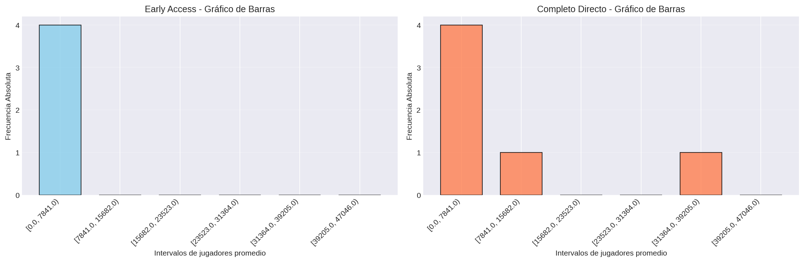
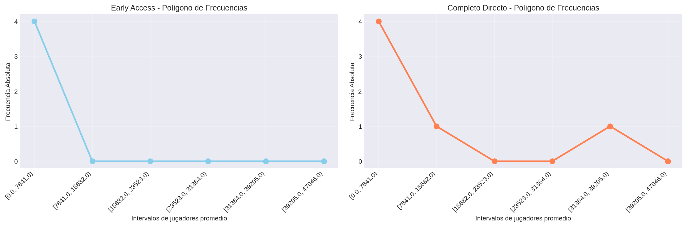
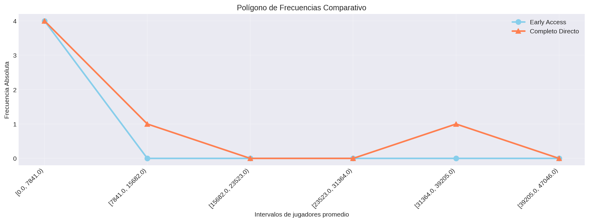
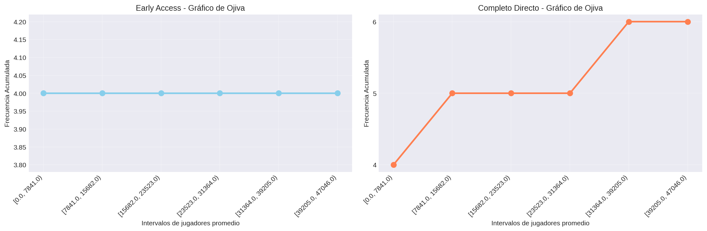
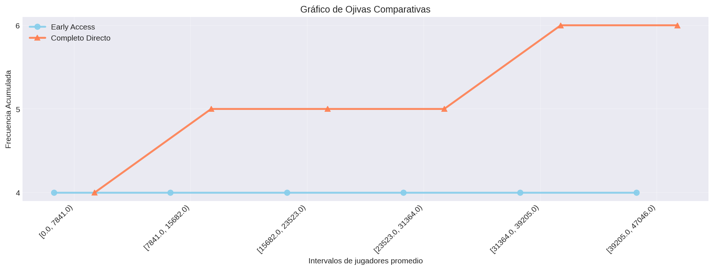
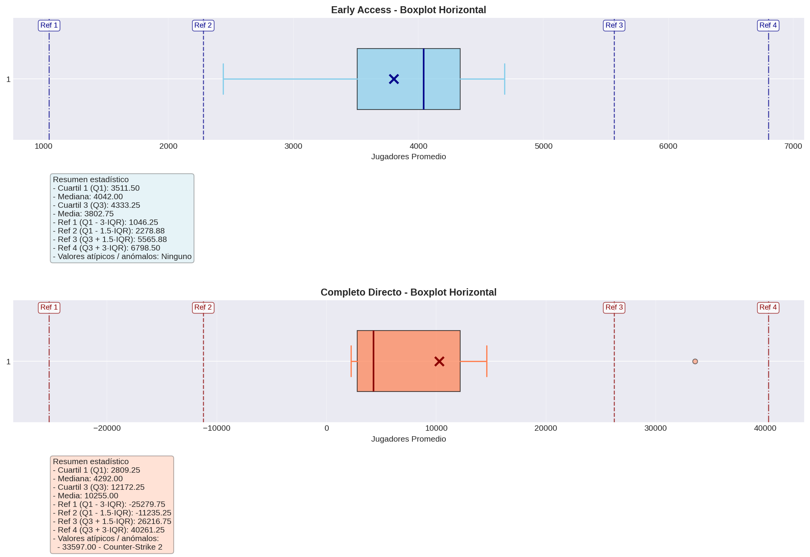
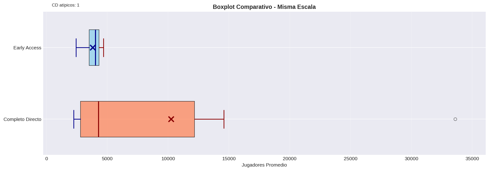

# Jugadores Promedio

## Frecuencias

El conjunto actual contiene 44 juegos: 19 en Early Access y 25 en Completo Directo.

### Juegos en Early Access
| Categoría / Intervalo | fi | hi | Fi | Hi |
|---|---:|---:|---:|---:|
| [0.0, 1.0) | 19 | 1.0 | 19 | 1.0 |
| [1.0, 2.0) | 0 | 0.0 | 19 | 1.0 |

**Total de juegos:** 19

### Juegos en Completo Directo
| Categoría / Intervalo | fi | hi | Fi | Hi |
|---|---:|---:|---:|---:|
| [0.0, 1.0) | 25 | 1.0 | 25 | 1.0 |
| [1.0, 2.0) | 0 | 0.0 | 25 | 1.0 |

**Total de juegos:** 25

### Visualización - Gráficos de Barras

### Visualización - Polígono de Frecuencias

### Visualización - Gráficos de Ojiva

### Visualización - Boxplot Horizontal

### Visualización - Boxplot Comparativo

### Visualización - Dispersograma

