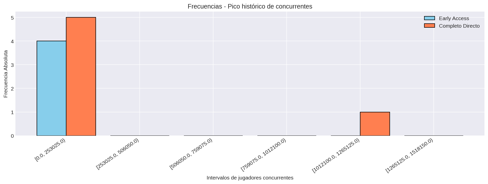

# Pico Histórico de Jugadores Concurrentes

## Frecuencias

### Juegos en Early Access
| Categoría / Intervalo | fi | hi | Fi | Hi |
|---|---:|---:|---:|---:|
| [0.0, 253025.0) | 4 | 1.0 | 4 | 1.0 |
| [253025.0, 506050.0) | 0 | 0.0 | 4 | 1.0 |
| [506050.0, 759075.0) | 0 | 0.0 | 4 | 1.0 |
| [759075.0, 1012100.0) | 0 | 0.0 | 4 | 1.0 |
| [1012100.0, 1265125.0) | 0 | 0.0 | 4 | 1.0 |
| [1265125.0, 1518150.0) | 0 | 0.0 | 4 | 1.0 |

**Total de juegos:** 4

### Juegos en Completo Directo
| Categoría / Intervalo | fi | hi | Fi | Hi |
|---|---:|---:|---:|---:|
| [0.0, 253025.0) | 5 | 0.833 | 5 | 0.833 |
| [253025.0, 506050.0) | 0 | 0.0 | 5 | 0.833 |
| [506050.0, 759075.0) | 0 | 0.0 | 5 | 0.833 |
| [759075.0, 1012100.0) | 0 | 0.0 | 5 | 0.833 |
| [1012100.0, 1265125.0) | 1 | 0.167 | 6 | 1.0 |
| [1265125.0, 1518150.0) | 0 | 0.0 | 6 | 1.0 |

**Total de juegos:** 6

### Visualización

