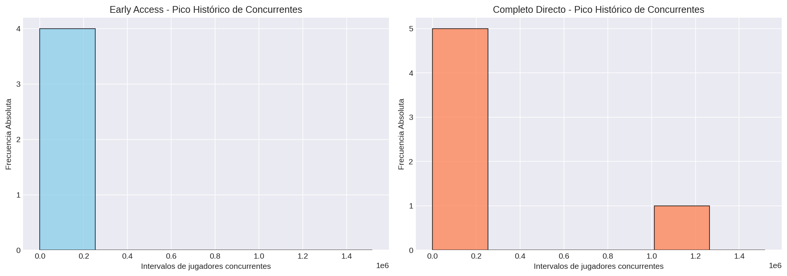
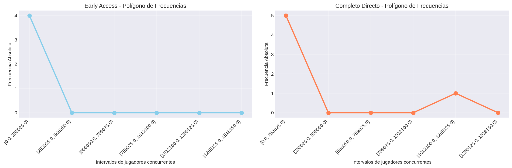
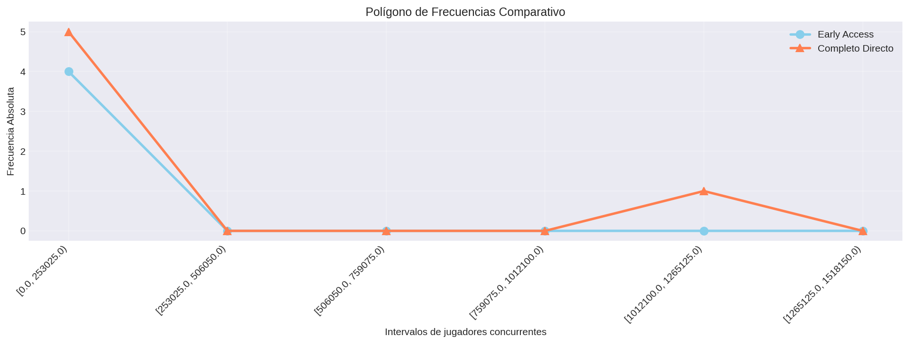
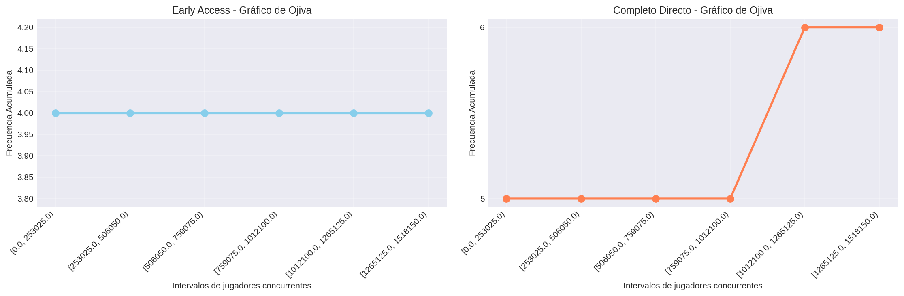
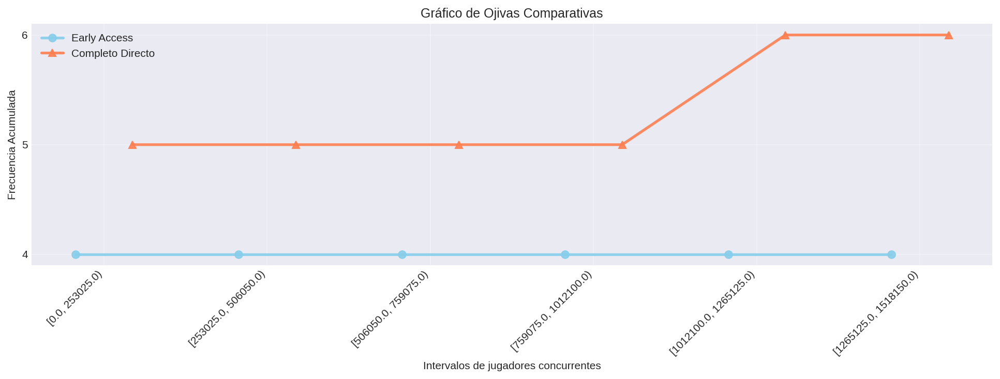
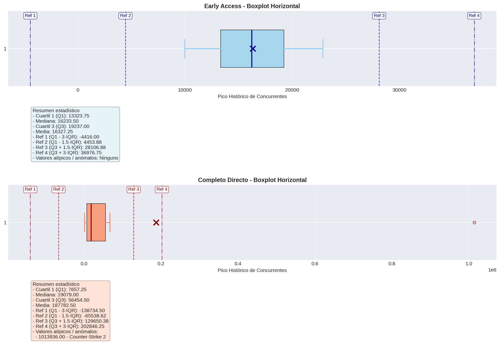
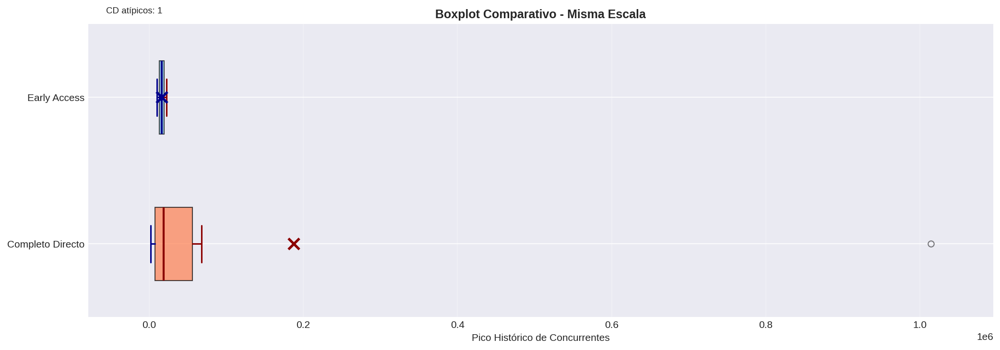

# Pico Histórico de Jugadores Concurrentes

## Frecuencias

El conjunto actual contiene 44 juegos: 19 en Early Access y 25 en Completo Directo.

### Juegos en Early Access
| Categoría / Intervalo | fi | hi | Fi | Hi |
|---|---:|---:|---:|---:|
| [0.0, 349934.0) | 15 | 0.789 | 15 | 0.789 |
| [349934.0, 699868.0) | 3 | 0.158 | 18 | 0.947 |
| [699868.0, 1049802.0) | 0 | 0.0 | 18 | 0.947 |
| [1049802.0, 1399736.0) | 0 | 0.0 | 18 | 0.947 |
| [1399736.0, 1749670.0) | 0 | 0.0 | 18 | 0.947 |
| [1749670.0, 2099604.0) | 0 | 0.0 | 18 | 0.947 |
| [2099604.0, 2449538.0) | 1 | 0.053 | 19 | 1.0 |
| [2449538.0, 2799472.0) | 0 | 0.0 | 19 | 1.0 |

**Total de juegos:** 19

### Juegos en Completo Directo
| Categoría / Intervalo | fi | hi | Fi | Hi |
|---|---:|---:|---:|---:|
| [0.0, 349934.0) | 17 | 0.68 | 17 | 0.68 |
| [349934.0, 699868.0) | 4 | 0.16 | 21 | 0.84 |
| [699868.0, 1049802.0) | 2 | 0.08 | 23 | 0.92 |
| [1049802.0, 1399736.0) | 1 | 0.04 | 24 | 0.96 |
| [1399736.0, 1749670.0) | 0 | 0.0 | 24 | 0.96 |
| [1749670.0, 2099604.0) | 1 | 0.04 | 25 | 1.0 |
| [2099604.0, 2449538.0) | 0 | 0.0 | 25 | 1.0 |
| [2449538.0, 2799472.0) | 0 | 0.0 | 25 | 1.0 |

**Total de juegos:** 25

### Visualización - Histograma

### Visualización - Polígono de Frecuencias

### Visualización - Polígono Junto

### Visualización - Ojiva

### Visualización - Ojiva Junto

### Visualización - Boxplot Horizontal

### Visualización - Boxplot Comparativo

