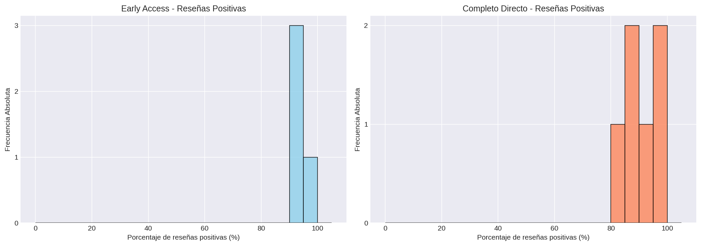
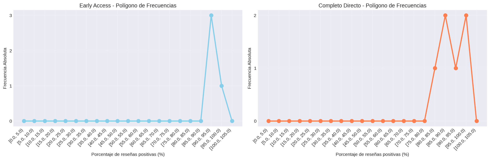
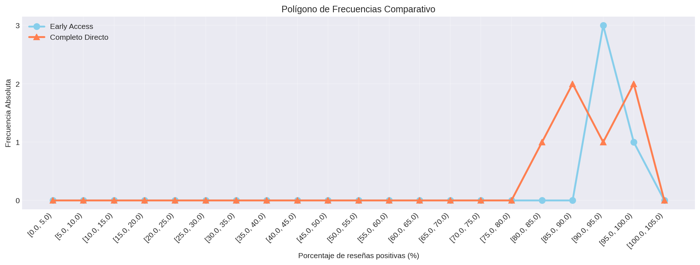
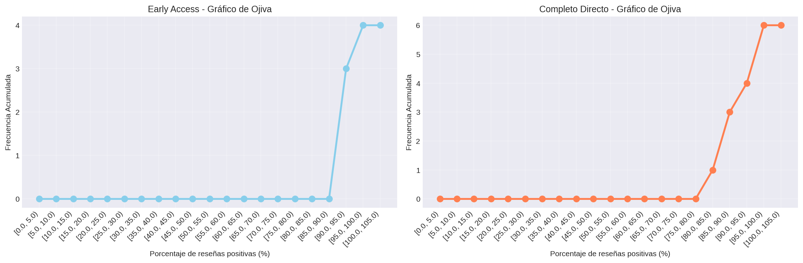
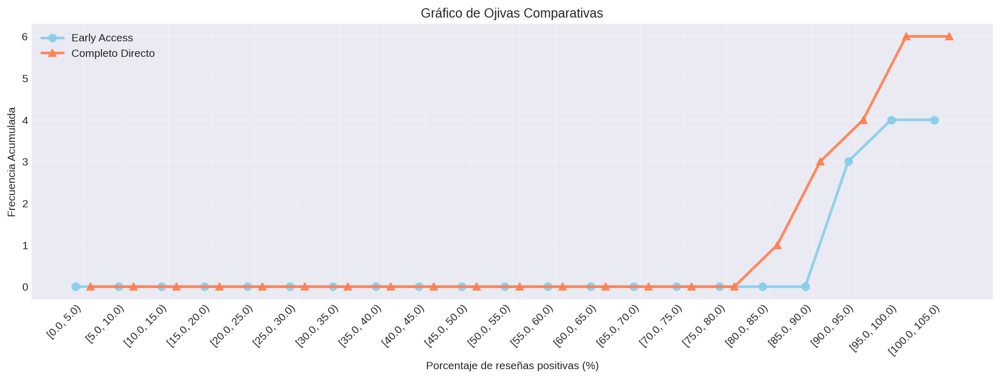
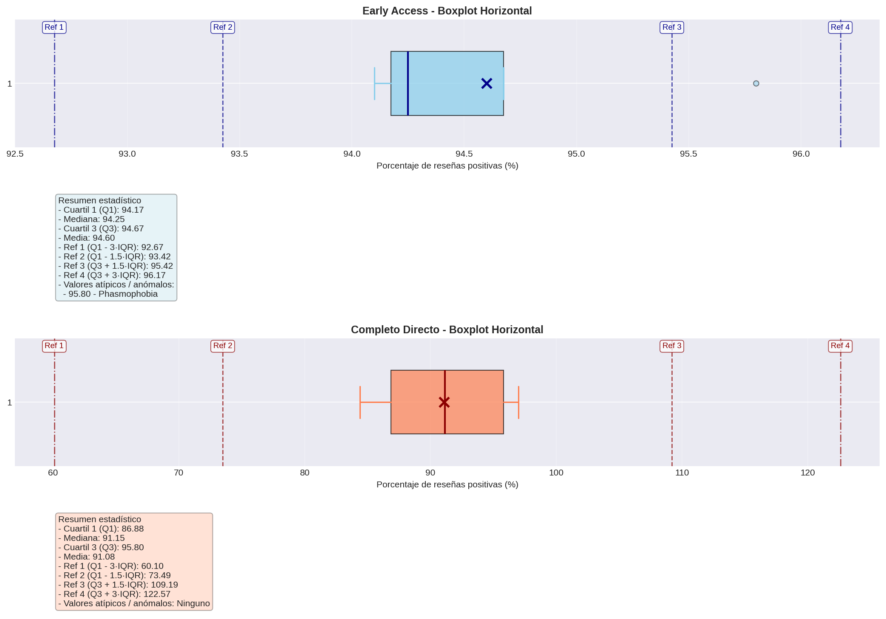
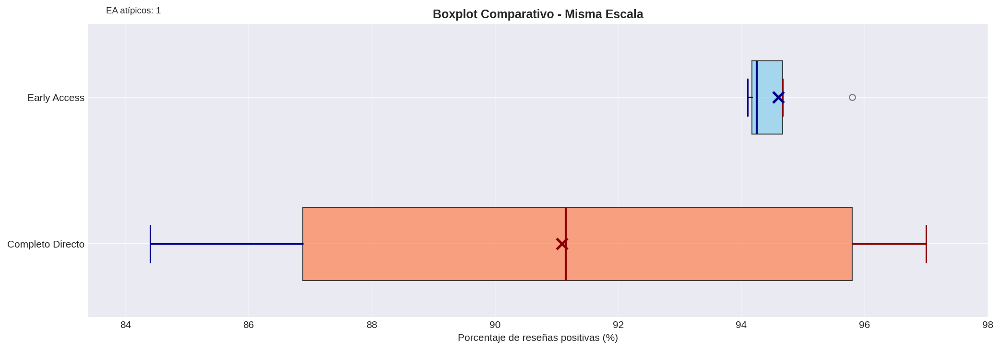

# Porcentaje de Reseñas Positivas

## Frecuencias

### Juegos en Early Access
| Categoría / Intervalo | fi | hi | Fi | Hi |
|---|---:|---:|---:|---:|
| [0.0, 5.0) | 0 | 0.0 | 0 | 0.0 |
| [5.0, 10.0) | 0 | 0.0 | 0 | 0.0 |
| [10.0, 15.0) | 0 | 0.0 | 0 | 0.0 |
| [15.0, 20.0) | 0 | 0.0 | 0 | 0.0 |
| [20.0, 25.0) | 0 | 0.0 | 0 | 0.0 |
| [25.0, 30.0) | 0 | 0.0 | 0 | 0.0 |
| [30.0, 35.0) | 0 | 0.0 | 0 | 0.0 |
| [35.0, 40.0) | 0 | 0.0 | 0 | 0.0 |
| [40.0, 45.0) | 0 | 0.0 | 0 | 0.0 |
| [45.0, 50.0) | 0 | 0.0 | 0 | 0.0 |
| [50.0, 55.0) | 0 | 0.0 | 0 | 0.0 |
| [55.0, 60.0) | 0 | 0.0 | 0 | 0.0 |
| [60.0, 65.0) | 0 | 0.0 | 0 | 0.0 |
| [65.0, 70.0) | 0 | 0.0 | 0 | 0.0 |
| [70.0, 75.0) | 0 | 0.0 | 0 | 0.0 |
| [75.0, 80.0) | 0 | 0.0 | 0 | 0.0 |
| [80.0, 85.0) | 0 | 0.0 | 0 | 0.0 |
| [85.0, 90.0) | 0 | 0.0 | 0 | 0.0 |
| [90.0, 95.0) | 3 | 0.75 | 3 | 0.75 |
| [95.0, 100.0) | 1 | 0.25 | 4 | 1.0 |
| [100.0, 105.0) | 0 | 0.0 | 4 | 1.0 |

**Total de juegos:** 4

### Juegos en Completo Directo
| Categoría / Intervalo | fi | hi | Fi | Hi |
|---|---:|---:|---:|---:|
| [0.0, 5.0) | 0 | 0.0 | 0 | 0.0 |
| [5.0, 10.0) | 0 | 0.0 | 0 | 0.0 |
| [10.0, 15.0) | 0 | 0.0 | 0 | 0.0 |
| [15.0, 20.0) | 0 | 0.0 | 0 | 0.0 |
| [20.0, 25.0) | 0 | 0.0 | 0 | 0.0 |
| [25.0, 30.0) | 0 | 0.0 | 0 | 0.0 |
| [30.0, 35.0) | 0 | 0.0 | 0 | 0.0 |
| [35.0, 40.0) | 0 | 0.0 | 0 | 0.0 |
| [40.0, 45.0) | 0 | 0.0 | 0 | 0.0 |
| [45.0, 50.0) | 0 | 0.0 | 0 | 0.0 |
| [50.0, 55.0) | 0 | 0.0 | 0 | 0.0 |
| [55.0, 60.0) | 0 | 0.0 | 0 | 0.0 |
| [60.0, 65.0) | 0 | 0.0 | 0 | 0.0 |
| [65.0, 70.0) | 0 | 0.0 | 0 | 0.0 |
| [70.0, 75.0) | 0 | 0.0 | 0 | 0.0 |
| [75.0, 80.0) | 0 | 0.0 | 0 | 0.0 |
| [80.0, 85.0) | 1 | 0.167 | 1 | 0.167 |
| [85.0, 90.0) | 2 | 0.333 | 3 | 0.5 |
| [90.0, 95.0) | 1 | 0.167 | 4 | 0.667 |
| [95.0, 100.0) | 2 | 0.333 | 6 | 1.0 |
| [100.0, 105.0) | 0 | 0.0 | 6 | 1.0 |

**Total de juegos:** 6

### Visualización - Histograma

### Visualización - Polígono de Frecuencias

### Visualización - Polígono Junto

### Visualización - Ojiva

### Visualización - Ojiva Junto

### Visualización - Boxplot Horizontal

### Visualización - Boxplot Comparativo

