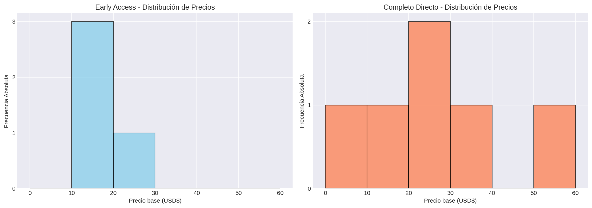

# Precio Base (USD)

## Frecuencias

### Juegos en Early Access
| Categoría / Intervalo | fi | hi | Fi | Hi |
|---|---:|---:|---:|---:|
| [0.0, 10.0) | 0 | 0.0 | 0 | 0.0 |
| [10.0, 20.0) | 3 | 0.75 | 3 | 0.75 |
| [20.0, 30.0) | 1 | 0.25 | 4 | 1.0 |
| [30.0, 40.0) | 0 | 0.0 | 4 | 1.0 |
| [40.0, 50.0) | 0 | 0.0 | 4 | 1.0 |
| [50.0, 60.0) | 0 | 0.0 | 4 | 1.0 |

**Total de juegos:** 4

### Juegos en Completo Directo
| Categoría / Intervalo | fi | hi | Fi | Hi |
|---|---:|---:|---:|---:|
| [0.0, 10.0) | 1 | 0.167 | 1 | 0.167 |
| [10.0, 20.0) | 1 | 0.167 | 2 | 0.333 |
| [20.0, 30.0) | 2 | 0.333 | 4 | 0.667 |
| [30.0, 40.0) | 1 | 0.167 | 5 | 0.833 |
| [40.0, 50.0) | 0 | 0.0 | 5 | 0.833 |
| [50.0, 60.0) | 1 | 0.167 | 6 | 1.0 |

**Total de juegos:** 6

### Visualización

