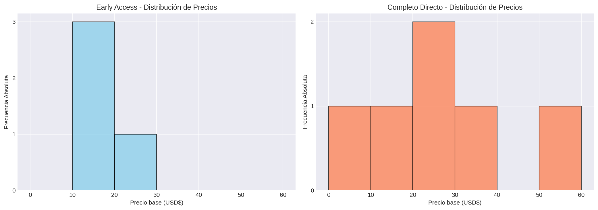
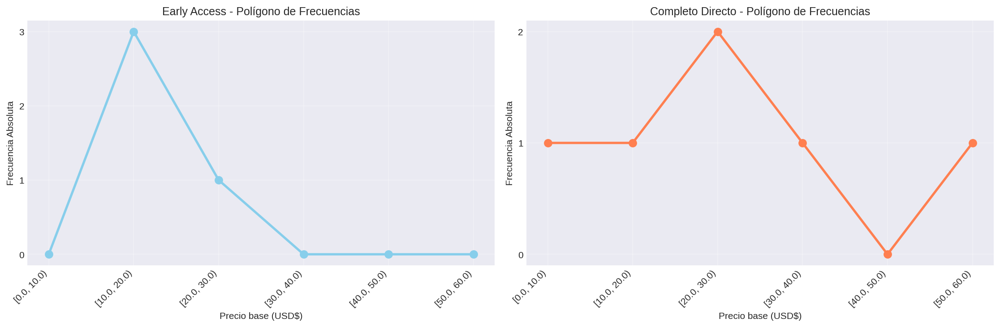
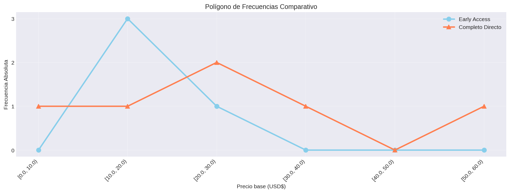
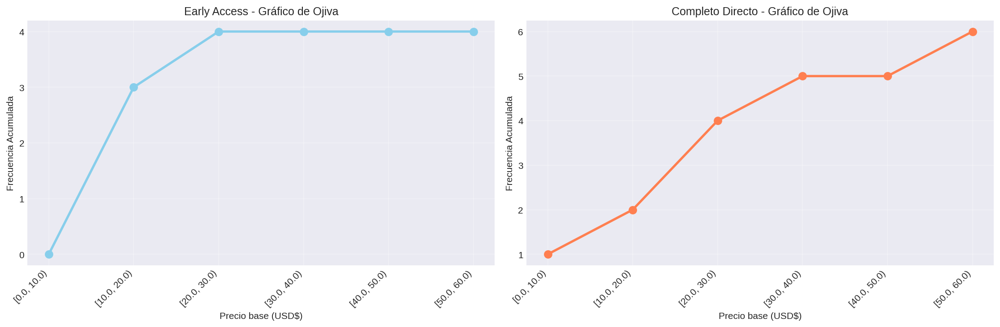
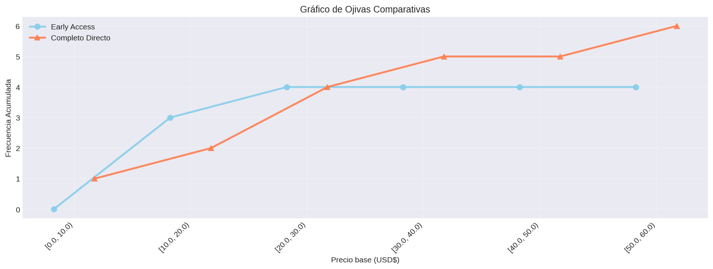
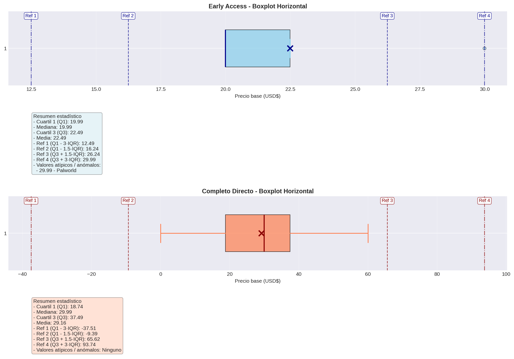
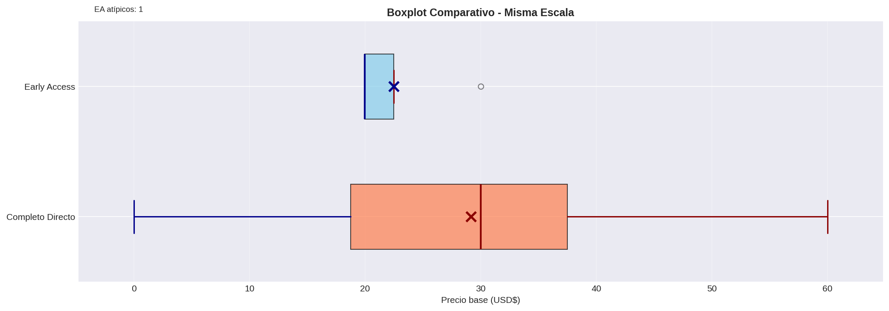

# Precio Base (USD)

## Frecuencias

El conjunto actual contiene 44 juegos: 19 en Early Access y 25 en Completo Directo.

### Juegos en Early Access
| Categoría / Intervalo | fi | hi | Fi | Hi |
|---|---:|---:|---:|---:|
| [0.0, 10.0) | 3 | 0.158 | 3 | 0.158 |
| [10.0, 20.0) | 6 | 0.316 | 9 | 0.474 |
| [20.0, 30.0) | 7 | 0.368 | 16 | 0.842 |
| [30.0, 40.0) | 1 | 0.053 | 17 | 0.895 |
| [40.0, 50.0) | 2 | 0.105 | 19 | 1.0 |
| [50.0, 60.0) | 0 | 0.0 | 19 | 1.0 |

**Total de juegos:** 19

### Juegos en Completo Directo
| Categoría / Intervalo | fi | hi | Fi | Hi |
|---|---:|---:|---:|---:|
| [0.0, 10.0) | 4 | 0.16 | 4 | 0.16 |
| [10.0, 20.0) | 4 | 0.16 | 8 | 0.32 |
| [20.0, 30.0) | 3 | 0.12 | 11 | 0.44 |
| [30.0, 40.0) | 8 | 0.32 | 19 | 0.76 |
| [40.0, 50.0) | 0 | 0.0 | 19 | 0.76 |
| [50.0, 60.0) | 6 | 0.24 | 25 | 1.0 |

**Total de juegos:** 25

### Visualización - Histograma

### Visualización - Polígono de Frecuencias

### Visualización - Polígono Junto

### Visualización - Ojiva

### Visualización - Ojiva Junto

### Visualización - Boxplot Horizontal

### Visualización - Boxplot Comparativo

### Visualización - Dispersograma

