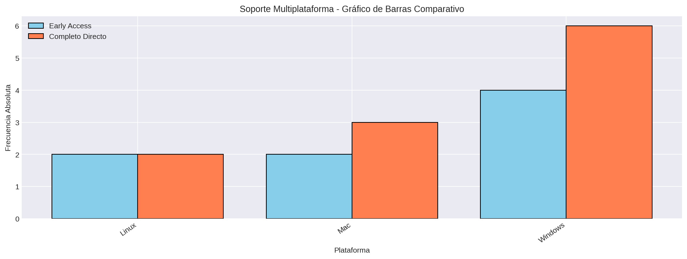

# Soporte Multiplataforma

## Frecuencias

El conjunto actual contiene 44 juegos: 19 en Early Access y 25 en Completo Directo.

### Juegos en Early Access (ocurrencias)
| Categoría / Intervalo | fi | hi | Fi | Hi |
|---|---:|---:|---:|---:|
| Linux | 2 | 0.087 | 2 | 0.087 |
| Mac | 2 | 0.087 | 4 | 0.174 |
| Windows | 19 | 0.826 | 23 | 1.0 |

**Total de juegos:** 23

### Juegos en Completo Directo (ocurrencias)
| Categoría / Intervalo | fi | hi | Fi | Hi |
|---|---:|---:|---:|---:|
| Linux | 11 | 0.239 | 11 | 0.239 |
| Mac | 10 | 0.217 | 21 | 0.457 |
| Windows | 25 | 0.543 | 46 | 1.0 |

**Total de juegos:** 46

### Visualización

### Visualización - Dispersograma

